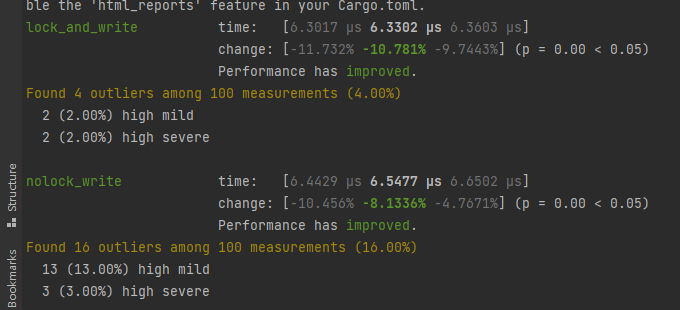
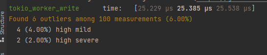

# pa_code_playground
record my bench tests

### 顺序bench

1.首先测试std有锁和无锁的连续写（锁没有影响



2.测试加入tokio 通道，单个thread worker写

```rust
fn tokio_worker_write(c: &mut Criterion){
    let mut f =touch();
    let (t,mut r)=tokio::sync::mpsc::channel(10);
    std::thread::spawn(
        move ||{
            loop{
                let res:tokio::sync::oneshot::Sender<()>=r.blocking_recv().unwrap();
                f.write("hhhh".as_bytes());
                res.send(()).unwrap();
            }
    });
    std::thread::sleep(std::time::Duration::from_secs(5));

    c.bench_function("tokio_worker_write", |b| b.iter(|| {
        let (t1,r1)=tokio::sync::oneshot::channel();
        t.blocking_send(t1);
        r1.blocking_recv();
    }));
}
```



可以发现。通道通信耗费挺多时间的。毕竟通道是用于并发环境下，
